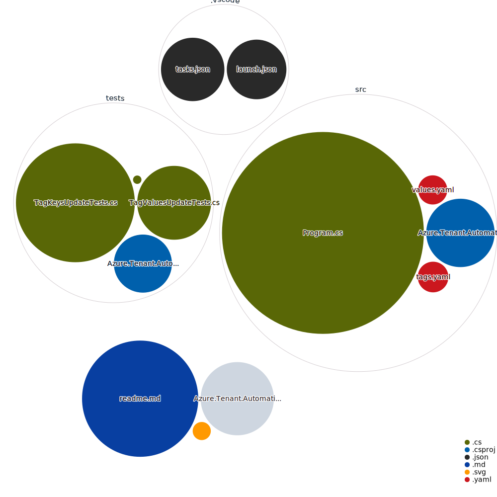

# Azure Tag Update Utility

## Overview

This is a utility developed to streamline the management of Azure resources. The application allows for the automated updating of tags across subscriptions, resource groups, and individual resources. It provides a convenient and time-saving solution for large-scale Azure resource management.

## Features

- Target specific Azure tenants and subscriptions for tag updates.
- Batch update tags on subscriptions, resource groups, and resources within these groups.
- Use an editable dictionary of targeted keys to specify which tags require transformation.
- Performance tracking via stopwatch functionality, with detailed console logging for transparency and troubleshooting.

## How it works

The utility uses Azure's ARM client to gather all subscriptions associated with a user's authentication. The utility then iterates over each subscription, updating tags on the subscription itself, and subsequently on its resource groups and the resources within those groups. 

Specific tags targeted for update are defined in the dictionary `tagKeysNeedingUpdated`. For each target tag key, the utility updates the key while retaining the original value. 

For example, if you want to rename the tag key "Client" to "Customer" across all selected Azure resources while maintaining the same values, this utility will handle that task efficiently.

## Usage

1. Configure `targetTenant`, `targetSubscription`, and `targetResourceGroup` in the main method. These are used to specify the scope of the tag updates. 
2. Define the tags you want to update in the `tagKeysNeedingUpdated` dictionary. The key is the current tag, and the value is the new tag name.
3. Run the application. It will iterate over all subscriptions, resource groups, and resources as per the scope specified, updating the tags as per the `tagKeysNeedingUpdated` dictionary.

The console will display real-time updates about the subscription, resource group, and resource tags being updated. For each subscription, the utility logs the time taken to complete the updates, providing valuable insight into performance. 

## Important Notes

Please ensure that the Azure user has sufficient privileges to update the tags on the resources.

This utility is designed for simplicity and ease of use, and it provides an effective solution for basic Azure tag management. However, for complex tag management scenarios, more advanced solutions may be required.

This tool assumes that the subscriptions, resource groups, and resources requiring updates are independent of each other, and does not account for dependencies or conflicts that may arise due to tag updates.

As this utility makes several requests to the Azure API, please be mindful of potential rate limiting issues. It is recommended to test the tool with a smaller scope before deploying it at scale.

## Code Example

```csharp
private readonly Dictionary<string, string> tagKeysNeedingUpdated = new()
{
    { "Client", "Customer" },
    { "Application", "Project" },
    { "App", "Project" }
};

foreach (var sub in azure.GetSubscriptions())
{
    Stopwatch stopWatch = new Stopwatch();
    stopWatch.Start();

    SubscriptionData? subscription = sub.Data;
    if (subscription.TenantId.ToString() != targetTenant) continue;
    if (!String.IsNullOrEmpty(targetSubscription) && subscription.SubscriptionId != targetSubscription) continue;

    await UpdateSubscriptionTags(sub);
    await UpdateResourceGroupsTags(sub);

    stopWatch.Stop();
    TimeSpan ts = stopWatch.Elapsed;

    Console.WriteLine($"Finished updating {subscription.DisplayName} ({subscription.SubscriptionId}) in {ts.TotalSeconds} seconds.");
}
```

---

This utility represents a simple, yet powerful, tool for managing tags across Azure resources. It helps maintain consistency and uniformity, leading to better organization and tracking of resources. We hope this utility proves useful in your Azure resource management efforts.

## Repository Visualizer
