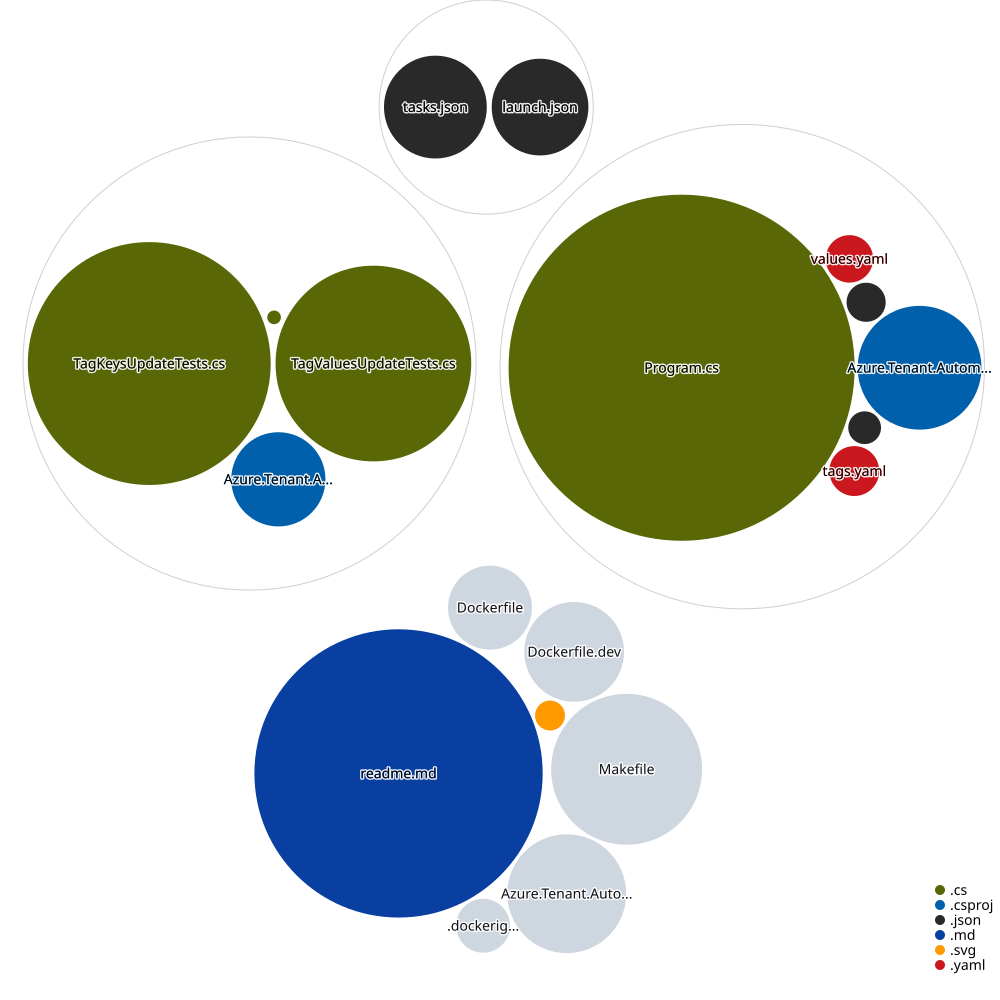

# Azure Tag Update Utility

## Overview

The Azure Tag Update Utility is a streamlined tool developed for managing Azure resources effectively. This utility automates the task of updating tags across Azure subscriptions, resource groups, and resources within them. The tool supports both tag key renaming and tag value updates, making it a powerful instrument for easy large-scale resource management in Azure.

## Features

- Specify target Azure tenants, subscriptions, and resource groups for tag updates.
- Automated batch update of tags across subscriptions, resource groups, and resources with parallel processing for improved performance.
- **Tag Key Updates**: Define a mapping of current tag keys to new tag keys in `tags.yaml` for flexible and persistent configurations.
- **Tag Value Updates**: Define a mapping of current tag values to new tag values in `values.yaml` to standardize tag values across resources.
- Performance tracking via stopwatch functionality, with detailed console logging for transparency and troubleshooting.
- Comprehensive error handling with graceful failure recovery.
- Built on .NET 8.0 with Azure Resource Manager SDK.

## How it works

This utility uses Azure's ARM client to gather all subscriptions associated with a user's authentication. It then processes subscriptions in parallel, filtering by tenant ID, subscription ID, and resource group name as specified. For each subscription, it updates tags on:
1. The subscription itself
2. All resource groups within the subscription
3. All resources within each resource group

The utility performs two types of tag updates:

1. **Tag Key Updates**: Renames tag keys while preserving their values. Defined in `tags.yaml`, where the key is the current tag key name and the value is the new tag key name.
   - Example: Renaming "Client" to "Customer" while keeping the same value.

2. **Tag Value Updates**: Updates tag values while preserving the tag keys. Defined in `values.yaml`, where the key is the current tag value and the value is the new tag value.
   - Example: Changing all instances of "Internal" to "Mesh" across all tags.

Both update operations are applied sequentially (keys first, then values) to ensure consistent results.

## Usage

1. **Configure the YAML files**:
   - `tags.yaml`: Define tag key mappings (current key → new key)
   - `values.yaml`: Define tag value mappings (current value → new value)
   
   Both files are located in the `src` directory and are automatically copied to the output directory during build.

2. **Configure Azure settings**:
   
   **Option A: Using appsettings.json (Recommended for local development)**
   - Copy `appsettings.example.json` to `appsettings.json`
   - Update the values:
     ```json
     {
       "Azure": {
         "TargetTenant": "your-tenant-id-here",
         "TargetSubscription": "",  // Optional: leave empty for all subscriptions
         "TargetResourceGroup": ""   // Optional: leave empty for all resource groups
       }
     }
     ```
   
   **Option B: Using environment variables (Recommended for Docker/containers)**
   - Environment variables override `appsettings.json` values
   - Use double underscores (`__`) for nested keys:
     ```bash
     export Azure__TargetTenant="your-tenant-id-here"
     export Azure__TargetSubscription=""  # Optional
     export Azure__TargetResourceGroup=""  # Optional
     ```
   
   **Note**: `TargetTenant` is required. `TargetSubscription` and `TargetResourceGroup` are optional filters.

3. **Authenticate with Azure**: Ensure you have Azure CLI or appropriate credentials configured for `DefaultAzureCredential`.
   - For local development: Run `az login` on your host machine
   - For Docker: Use `make run-dev` which automatically mounts your Azure CLI credentials
   - For production: Use managed identity or service principal credentials via environment variables

4. **Run the application**: 
   - **Using Docker (Recommended)**: `make run-dev` (for local) or `make run` (for production)
   - **Using .NET directly**: `dotnet run --project src/Azure.Tenant.Automation.csproj`
   
   The utility will process all matching subscriptions, resource groups, and resources in parallel, updating tags according to your YAML configurations.

The console will display real-time updates about the subscription, resource group, and resource tags being updated. For each subscription, the utility logs the time taken to complete the updates, providing valuable insight into performance.

### Test Suite
The Azure Tag Update Utility includes a robust test suite that validates and ensures the correctness of both tag key and tag value updating logic. Utilizing the xUnit framework, the test suite is organized into two test classes:

- `TagKeysUpdateTests`: Validates tag key renaming functionality with various scenarios including edge cases
- `TagValuesUpdateTests`: Validates tag value updating functionality

These tests are structured according to the Arrange-Act-Assert pattern and are designed to ensure the code's reliability and maintainability. The test suite verifies that the utility performs as intended and safeguards against future modifications breaking the current functionality. 

## Important Notes

- Please ensure that the Azure user has sufficient privileges to update the tags on the resources.
- This utility is designed for simplicity and ease of use, and it provides an effective solution for basic Azure tag management. However, for complex tag management scenarios, more advanced solutions may be required.
- This tool assumes that the subscriptions, resource groups, and resources requiring updates are independent of each other, and does not account for dependencies or conflicts that may arise due to tag updates.
- As this utility makes several requests to the Azure API in parallel, please be mindful of potential rate limiting issues. It is recommended to test the tool with a smaller scope before deploying it at scale.
- Make sure both `tags.yaml` and `values.yaml` files exist and are in the correct format. An incorrect or missing file will result in a runtime error.
- Configuration can be provided via `appsettings.json` or environment variables. Environment variables take precedence, making this Docker-friendly. The `TargetTenant` setting is required.
- The utility processes subscriptions, resource groups, and resources in parallel for improved performance. Error handling ensures that failures in one resource don't stop processing of others.
- When updating tag keys, if the new key already exists on a resource, the update for that specific key will be skipped with a warning message to prevent data loss.
- Only subscriptions with "Enabled" state are processed. Disabled subscriptions are automatically skipped.

## Docker Support

The application includes Dockerfiles for both production and local development deployments. A Makefile is provided to simplify Docker operations.

### Quick Start with Makefile (Recommended)

The easiest way to build and run the container is using the provided Makefile:

**For Local Development:**
```bash
# Build the dev image (includes Azure CLI for local auth)
make build-dev

# Run with local config files and Azure CLI credentials mounted
# Requires: az login on your host machine
make run-dev
```

**For Production:**
```bash
# Build the production image
make build

# Run the container (uses baked-in config or environment variables)
make run
```

**Other Useful Commands:**
```bash
make help          # Show all available commands
make clean         # Remove containers and images
make clean-all     # Clean everything including build cache
```

### Manual Docker Commands

#### Building Docker Images

**Production Image:**
```bash
docker build -t azure-tenant-automation -f Dockerfile .
```

**Development Image (includes Azure CLI):**
```bash
docker build -t azure-tenant-automation-dev -f Dockerfile.dev .
```

#### Running the Container

**For Local Development:**
The `run-dev` Makefile target mounts your local config files and Azure CLI credentials:

```bash
docker run --rm \
  -v $(PWD)/src/appsettings.json:/app/appsettings.json:ro \
  -v $(PWD)/src/tags.yaml:/app/tags.yaml:ro \
  -v $(PWD)/src/values.yaml:/app/values.yaml:ro \
  -v ~/.azure:/home/appuser/.azure \
  -e HOME=/home/appuser \
  -e AZURE_CONFIG_DIR=/home/appuser/.azure \
  azure-tenant-automation-dev
```

**For Production (using environment variables):**
```bash
docker run --rm \
  -e Azure__TargetTenant="your-tenant-id-here" \
  -e Azure__TargetSubscription="" \
  -e Azure__TargetResourceGroup="" \
  azure-tenant-automation
```

**Note**: For local development, the `.azure` directory is mounted as read-write to allow Azure CLI to write cache files. For production deployments, use managed identity or service principal credentials configured via environment variables for `DefaultAzureCredential` (see below).

### Using Azure Managed Identity (Recommended for Production)

When running in Azure (e.g., Azure Container Instances, Azure Kubernetes Service), you can use managed identity:

```bash
docker run --rm \
  -e Azure__TargetTenant="your-tenant-id-here" \
  -e AZURE_CLIENT_ID="managed-identity-client-id" \
  azure-tenant-automation
```

### Dockerfile Differences

- **`Dockerfile`**: Production image - minimal runtime image without Azure CLI
- **`Dockerfile.dev`**: Development image - includes Azure CLI for local authentication via `az login` credentials

## Repository Visualizer


---

This utility represents a simple, yet powerful, tool for managing tags across Azure resources. It helps maintain consistency and uniformity, leading to better organization and tracking of resources. We hope this utility proves useful in your Azure resource management efforts.